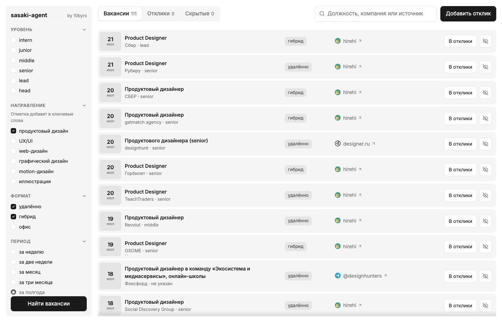

# sasaki-agent

Личный агент поиска работы. Раз в 6 часов сам обходит 19 источников вакансий,
отбирает подходящие по твоим критериям и показывает их в локальном пульте —
с фильтрами и трекером откликов. Дубли отсеивает, уже показанное не повторяет.

Всё работает на твоём компьютере: критерии, найденные вакансии и статусы
откликов никуда не уходят и никому не видны.

```bash
git clone https://github.com/peachcardinal/sasaki-agent.git
cd sasaki-agent
npm run setup
```

Нужен только **Node.js ≥ 21**. Вопросов не будет: установка ставит автозапуск,
поднимает пульт и сама открывает `http://127.0.0.1:4321`. Там на первом экране
отмечаешь, кого ищешь, жмёшь «Найти вакансии» — и через полминуты смотришь
ленту. Всё остальное — источники, формат работы, стоп-слова, доставка — правится
там же и когда понадобится.

Никакие ИИ-агенты для установки и работы не нужны. Они пригодятся позже —
чтобы научить sasaki новым сайтам (см. [ниже](#новый-сайт-за-пару-минут)).

---

## Пульт



Локальная страница на `http://127.0.0.1:4321`. Наружу ничего не торчит,
`.env` не читается и не отдаётся.

- **Лента находок** с фильтрами слева: уровень (intern → head), направление
  (продуктовый, UX/UI, web, графический, motion, иллюстрация), формат работы,
  период, источники. Фильтры применяются на лету и сразу сохраняются.
- **Трекер откликов.** Переносишь вакансию в «Отклики» и ведёшь статус:
  Новый → Отклик → Собес → Тестовое → Оффер. Рядом хранится сопроводительное
  письмо. Неинтересное скрываешь — оно больше не мешает.
- **Отклик руками.** Нашёл вакансию сам (в LinkedIn, по знакомству) — кнопка
  «Добавить отклик», и она в том же трекере.
- **Прогон по кнопке** «Найти вакансии» с живым прогрессом, не дожидаясь
  расписания.
- Поиск по должности, компании и источнику с подсветкой совпадений.

## Откуда берутся вакансии

19 источников из коробки, ничего докачивать не надо.

**Агрегаторы и доски:** hirehi · designer.ru · finder · getmatch ·
Хабр Карьера · публичные телеграм-каналы · LinkedIn · hh.ru

**Карьерные сайты компаний:** Яндекс · VK · Т-Банк · Авито · X5 · МТС ·
Магнит · Wildberries · Точка · Альфа-Банк · 2ГИС

Про телеграм: читаются публичные каналы через веб-ленту `t.me/s/` — без
аккаунта, без ключей и без риска бана. Достаточно добавить `@канал` в конфиг;
прямая ссылка на пост нанимающего попадает в карточку вакансии.

Про hh.ru: нужен бесплатный токен (как получить — [docs/setup.md](docs/setup.md)).
Без токена источник просто выключен, остальные 18 работают.

Про LinkedIn: берутся публичные объявления через гостевой эндпоинт, без логина
и риска бана. Выбранные направления сами переводятся в англоязычные запросы,
поиск идёт по миру — так что это в первую очередь про международные и удалённые
вакансии; по российскому рынку выдача у LinkedIn слабая.

### Новый сайт за пару минут

Главное отличие sasaki от готовых агрегаторов: **список источников не
зафиксирован**. Понравилась вакансия на сайте, которого тут нет, — открой папку
проекта в [Claude Code](https://claude.com/claude-code) и скажи:

```
/add-source https://careers.example.com/vacancies
```

Агент сам разберётся, как сайт отдаёт данные (JSON API, RSS, SSR-HTML, AJAX),
напишет адаптер, проверит его на живых данных и подключит. Новый источник
появится в пульте сам.

Руками — тоже несложно: адаптер это один файл на 40 строк,
см. [docs/sources.md](docs/sources.md).

## Куда ещё приходят находки

Помимо пульта — любая комбинация: **Telegram-бот** · **markdown-файлы в папку**
(укажи Obsidian vault — будут прямо в заметках) · **CSV** · **вебхук**
(Slack / Discord / [ntfy.sh](https://ntfy.sh) для пуша на телефон).

## Автозапуск

`npm run setup` ставит его сам. Отдельно — так:

```bash
npm run service install    # поставить
npm run service            # статус
npm run service uninstall  # снять
```

Ставятся две фоновые задачи: сборщик раз в 6 часов и пульт, который висит
всегда — стартует при входе в систему и поднимается сам, если упал. Пульт
замечает изменения кода и перезапускается с новой версией, так что после
`git pull` ничего перезапускать руками не нужно.

На Linux автоустановки нет: `npm run service` напечатает готовые строки для
crontab и systemd.

## Обновление

```bash
git pull
```

Личное — `config.json`, `.env`, `data/`, твои адаптеры в `sources.local/` —
в гит не попадает, поэтому обновление не конфликтует с твоими настройками.
Пульт подхватит новую версию сам.

## Настройка после старта

Критерии и источники правятся прямо в пульте. Всё остальное — в
[config.json](config.example.json), секреты — в `.env`. Изменения
подхватываются на следующем прогоне.

Подробнее: [docs/setup.md](docs/setup.md) — токены, расписание, тонкости
фильтра · [docs/sources.md](docs/sources.md) — как устроены источники.

## Как это работает внутри

```
источники → фильтр → дедуп → доставка → архив
```

Каждый источник — отдельный файл в `src/sources/`, возвращает список вакансий.
Фильтр отбирает по ключевым словам, направлению, грейду и формату работы.
Дедуп убирает повторы между источниками (одна вакансия из телеграма и с сайта
компании — одна карточка) и не показывает то, что уже приходило. Дальше —
доставка в выбранные каналы и архив в `data/jobs.json`, из которого живёт пульт.

Node без единой зависимости — только стандартная библиотека.

## Лицензия

[MIT](LICENSE) — бери, меняй, пользуйся.
